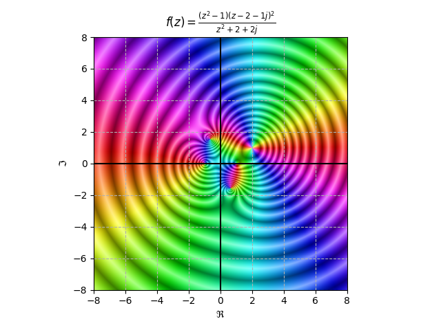
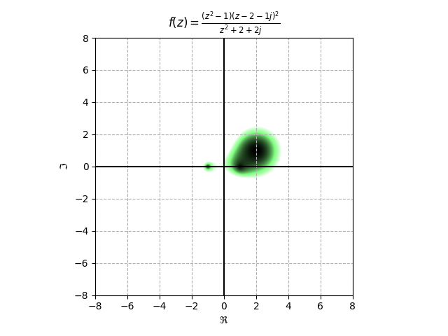

# DColor: A Domain Coloring Python Module

## What is DColor?

DColor is a Python 3 module for visualizing complex-valued functions using a [Domain Coloring](https://en.wikipedia.org/wiki/Domain_coloring) scheme.

## Requirements

DColor leverages two well-known Python libraries: [NumPy](https://numpy.org/) and [Matplotlib](https://matplotlib.org/).

### Old (`pip`)

Before being able to use DColor, you must install these using the following commands:

```bash
python3 -m pip install -U numpy
python3 -m pip install -U matplotlib
git clone https://github.com/hernanat/dcolor.git
```

### New (`poetry`)

For development, first, install [poetry](https://python-poetry.org/).
Typically, this involves installing `pipx` followed by `pipx install poetry`.
Arch-based systems can also install the `python-poetry` package.

Clone the repository and run `poetry install`.
This will install the project and its requirements to a clean virtual environment which can be accessed through `poetry shell`.

```bash
git clone https://github.com/hernanat/dcolor.git
poetry install
poetry shell
```

<!-- TODO
Figuring out how to install this this more permanently is a hanging question.
Poetry will let you build a wheel and tarball with `poetry build`, but getting this into PyPI would be better.
-->

## Usage

Heres's a short script which plots a function with poles and zeros.
A lambda expression is used to define the function, which is then passed to `dcolor.plot`.

```python
import dcolor
import matplotlib.pyplot as plt

plt.title("$f(z) = \\frac{(z^2 - 1)(z - 2 - 1j)^2}{z^2 +2+ 2j}$")
dcolor.dcolor(
  lambda z : ((z**2 - 1)*(z - 2 - 1j)**2)/(z**2 + 2 + 2j),
  xlim=(-8, 8),
  ylim=(-8, 8),
)
# plt.show() called implicitly
```

## Examples

A selection of example functions can be plotted from `examples/example.py`.
It contains several command-line options for both spawning interactive plots and
generating static images.

The example images below can be plotted with the following command, which plots the
same function from the usage section:

```bash
python examples/example.py -s algebraic.3 -c {METHOD}
```

Note that this script may not function outside of the poetry virtual environment.

### Default method (magnitude_oscillating)

The default method assigns the complex argument to hue.
Increasing magnitudes produce an effect resembling logarithmically-spaced contours.


### raw_magnitude_oscillating

This is like the default, except that it does not convert the HSV image to RGB.



### green_magnitude

This is designed to show  the magnitude of z.
White means big, shades of green means intermediate, and black means small.




## Website and Documentation

Currently, this is a one-person project and so these are still under construction. Contact me by e-mail at roguegdi27@gmail.com if you would like to help out with anything.

## Contributing

If you are interested in contributing or have any suggested changes, clone the repo and make a pull request :)
