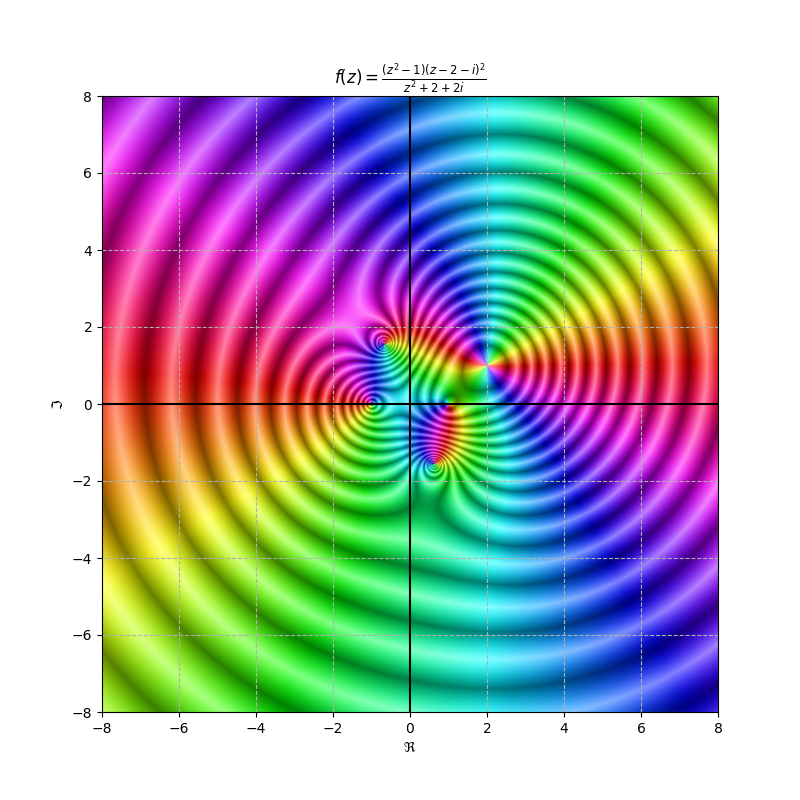
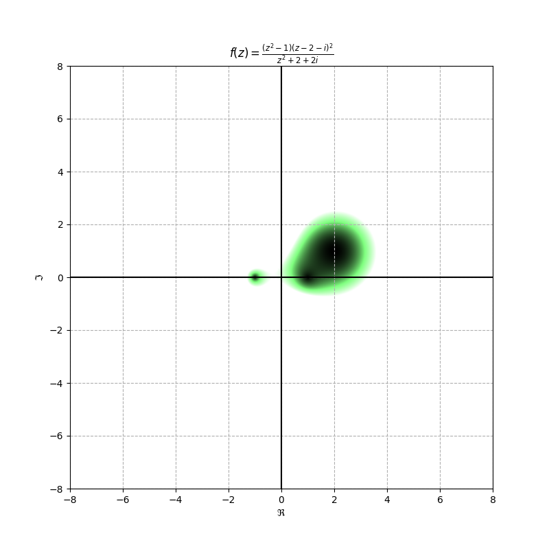
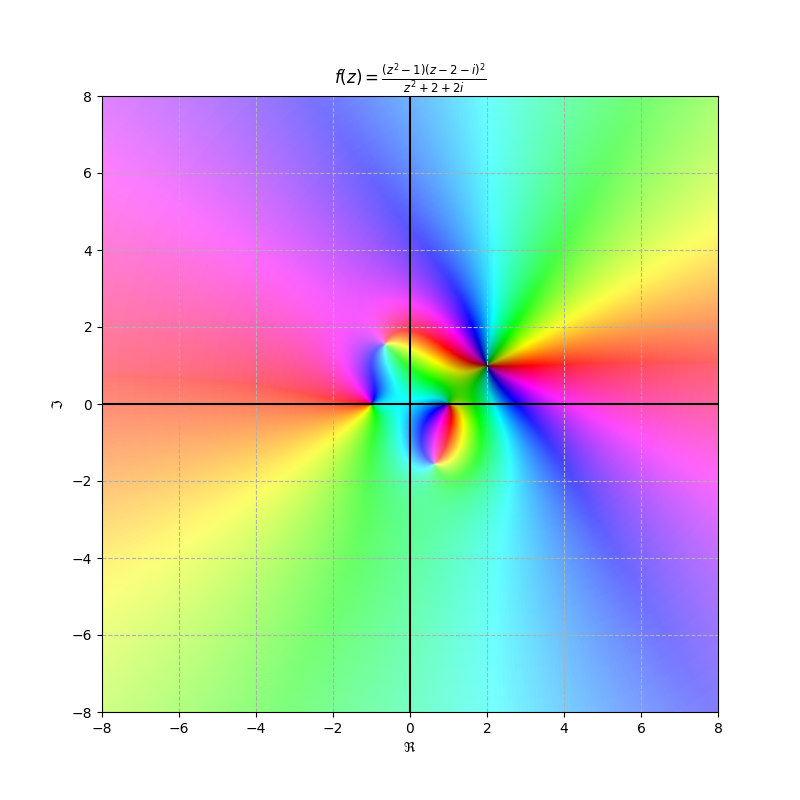

# DColor: A Domain Coloring Python Module

## What is DColor?

DColor is a Python 3 module for visualizing complex-valued functions using a [Domain Coloring](https://en.wikipedia.org/wiki/Domain_coloring) scheme.

## Requirements

DColor leverages two well-known Python libraries: [NumPy](https://numpy.org/) and [Matplotlib](https://matplotlib.org/).

### Old (`pip`)

Before being able to use DColor, you must install these using the following commands:

```bash
python3 -m pip install -U numpy
python3 -m pip install -U matplotlib
git clone https://github.com/hernanat/dcolor.git
```

### New (`poetry`)

For development, first, install [poetry](https://python-poetry.org/).
Typically, this involves installing `pipx` followed by `pipx install poetry`.
Arch-based systems can also install the `python-poetry` package.

Clone the repository and run `poetry install`.
This will install the project and its requirements to a clean virtual environment which can be accessed through `poetry shell`.

```bash
git clone https://github.com/hernanat/dcolor.git
poetry install
poetry shell
```

<!-- TODO 
Figuring out how to install this this more permanently is a hanging question.
Poetry will let you build a wheel and tarball with `poetry build`, but getting this into PyPI would be better.
-->

## Examples

Note that `python` commands in this section should be run inside the virtual environment.

### Default

```bash
python dcolorExample.py
```

It generates a series of examples.
When each image appears clicking the close button starts the next example.
Lambda expressions are used to define and pass functions to the plot() function.
The last example is:

```python
dc.plot(lambda z : ((z**2-1)*(z-2- 1j)**2)/(z**2 +2+ 2j),
    title='((z**2-1)*(z-2- 1j)**2)/(z**2 +2+ 2j)')
```

Which results in the following plot:


### hsvcolor

This is like dcolor except that it does not convert the HSV image to RGB

```bash
python hsvcolorExample.py
```

Will create the images.
The last image produces:



### rgbcolor

This is designed to show  the magnitude of abs(z).
White means big, shades of green means intermediate, and black means small.

```bash
python rgbcolorExample.py
```

Will create the images.
The last image produces:



### Domain Pole/Zero

A function similar to the default, but which does not oscillate, and plots
values near poles as brighter and values near zeroes as darker.
Decent for up to fifth-order zeroes.

```bash
python magExample.py
```

Will create the images.
The last image produces:



## Website and Documentation

Currently, this is a one-person project and so these are still under construction. Contact me by e-mail at roguegdi27@gmail.com if you would like to help out with anything.

## Contributing

If you are interested in contributing or have any suggested changes, clone the repo and make a pull request :)
